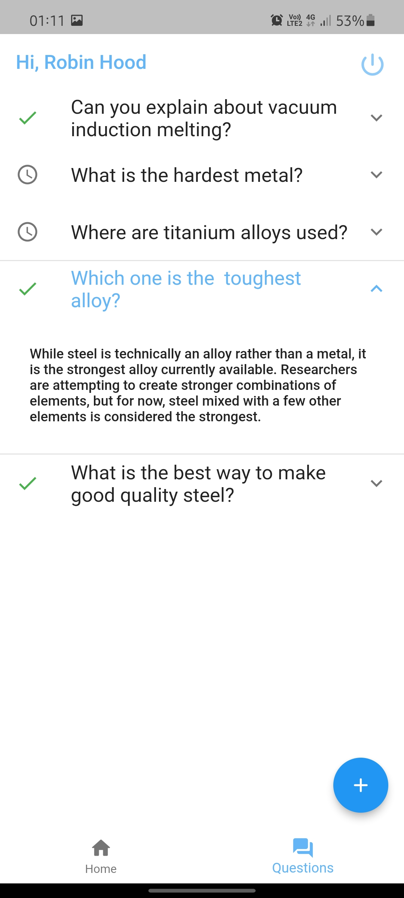

# expertalk

An app to connect to subject matter experts in a hackathon.

Created for HACK101 hackathon conducted by IEDC, GECBH

- [Download the App](https://github.com/RohitEdathil/expertalk/releases/tag/v1.0.0)
- [View Report](https://docs.google.com/document/d/1yJzodiBney5KAUtiVruI49g8KgyHG21N0nNMd3YtDJ8/edit?usp=sharing)
- [Demo Video](https://drive.google.com/file/d/1H6FIWGhNnokrgtmuiY3zIAqWOSsNE7V1/view?usp=drivesdk)

# Screenshots
  
  

